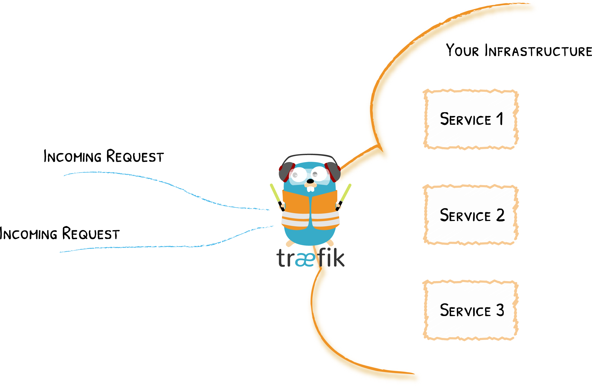

# 概念

你需要知道的一切
{: .subtitle }

## 边缘路由器

Traefik是_边缘路由器_，这意味着它是通向你平台的大门，拦截并路由每个传入的请求：对于哪些服务处理何种请求，它了解所有的逻辑和规则（基于[路径(path)](../routing/routers/index.md#rule)，[主机(host)](../routing/routers/index.md#rule)， [标头(headers)](../routing/routers/index.md#rule)，[等等](../routing/routers/index.md#rule)……）。

## 自动服务发现

传统上，边缘路由器（或反向代理）需要一个配置文件，其中包含通往服务的所有可能路由，而Traefik则从服务本身来获取它们。

部署服务时，将附加信息，这些信息告诉Traefik服务所能处理的请求的特征。

这意味着在部署服务时，Traefik会立即检测到该服务，并实时更新路由规则。
反之亦然：从基础架构中删除服务时，路由将相应消失。

不再需要创建和同步因IP或其他规则而混乱的配置文件。

!!! info "许多不同的规则"

    在上面的示例中，我们使用请求[路径(path)](../routing/routers/index.md#rule)来确定负责哪个服务，当然，也可以使用许多其他不同的[规则(rules)](../routing/routers/index.md#rule)。

!!! info "更新请求"

    在[中间件](../middlewares/overview.md)部分，可以了解在将请求转发到服务之前，如何将请求更新掉。

!!! question "Traefik如何发现服务？"

    Traefik能够使用集群API来发现服务，并读取附加的信息。在Traefik中，这些连接器称为[提供者](../providers/overview.md)，因为它们为Traefik_提供_配置。要了解更多，请阅读[提供商概述](../providers/overview.md)部分。
