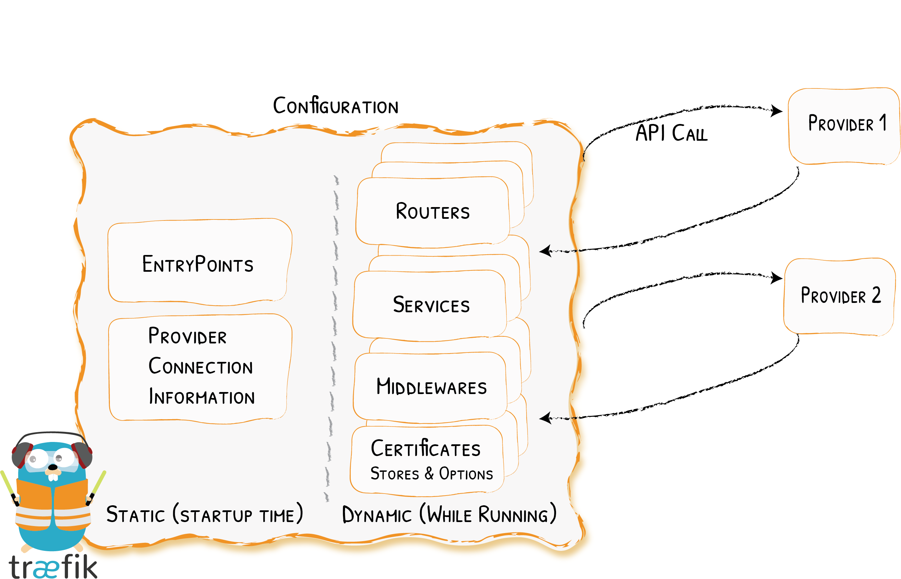

# 配置介绍

魔术是如何发生的
{: .subtitle }



Traefik中的配置可以引用两种不同的东西：

- 完全动态路由配置（称为_动态配置_）
- 启动时配置（称为_静态配置_）

_静态配置_ 中的元素建立了到[提供者](../providers/overview.md)的连接，并定义Traefik将侦听的[入口点](../routing/entrypoints.md)（这些元素不会经常更改）。

_动态配置_ 包含定义请求如何由系统处理的所有内容。此配置可以更改，并且可以无缝热重载，而不会导致任何请求中断或连接丢失。

!!! warning "不兼容的配置"
    请注意，截至目前，Traefik v1.x 的旧配置与 v2.x 配置不兼容。如果正在运行v2，请确保使用的是v2配置。

## 动态配置

Traefik从[提供者](../providers/overview.md)处获得其_动态配置_：编排器(Orchestrator)，服务注册表，或是普通的旧配置文件。

由于此配置特定于你选择的基础架构，因此请参考[本文档的特定部分](../routing/overview.md)。

!!! info ""

    在[快速入门示例](../getting-started/quick-start.md)中，动态配置来自Docker，其以标签形式附加在容器上。
    
!!! info "HTTPS证书也属于动态配置。"
    
    可以添加/更新/删除HTTPS证书，而无需重新启动Traefik实例。

## 静态配置

有三种不同的，**互斥的**方式（只能同时使用一种），用于在Traefik中定义静态配置选项：

1. 在配置文件中
1. 在命令行参数中
1. 作为环境变量

这些方法按上面列出的顺序进行评估。

如果没有为给定选项提供任何值，那么将应用默认值。
此外，如果选项具有子选项，并且未指定任何这些子选项，则默认值也将应用。
   
例如，`--providers.docker`选项本身足以启用docker提供者，即使存在`--providers.docker.endpoint`之类的子选项。
一旦定位后，此选项将设置（并重置）`--providers.docker`所有子选项的默认值。
    
### 配置文件

启动时，Traefik在以下位置搜索名为`traefik.toml`（或`traefik.yml`或`traefik.yaml`）的文件：

- `/etc/traefik/`
- `$XDG_CONFIG_HOME/`
- `$HOME/.config/`
- `.` (_the working directory_).

可以通过使用`configFile`参数来覆盖。

```bash
traefik --configFile=foo/bar/myconfigfile.toml
```

### 参数

获取所有可用参数列表：

```bash
traefik --help

# or

docker run traefik[:version] --help
# ex: docker run traefik:2.1 --help
```

所有可用参数也可以[在此找到](../reference/static-configuration/cli.md)。

### 环境变量

所有可用环境变量可以[在此找到](../reference/static-configuration/env.md)。

## 可用配置项

所有的配置选项都在其相关部分中记录。

You can browse the available features in the menu, the [providers](../providers/overview.md), or the [routing section](../routing/overview.md) to see them in action.
