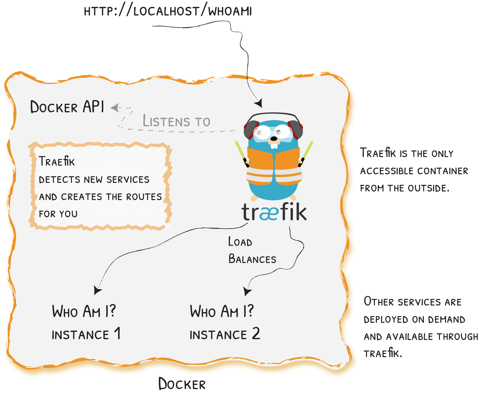

# 快速入门

一个使用Docker的简单场景
{: .subtitle }



## 随Docker提供者启动Traefik

创建一个`docker-compose.yml`文件，将在其中定义一个使用官方Traefik镜像的`reverse-proxy`服务：

```yaml
version: '3'

services:
  reverse-proxy:
    # 官方 v2 Traefik docker 镜像
    image: traefik:v2.1
    # 启用Web UI，并告知Traefik监听Docker
    command: --api.insecure=true --providers.docker
    ports:
      # HTTP 端口
      - "80:80"
      # Web UI (通过 --api.insecure=true 启用)
      - "8080:8080"
    volumes:
      # 如此Traefik可以监听Docker事件
      - /var/run/docker.sock:/var/run/docker.sock
```

**就这样。现在，你可以启动Traefik！**

用以下命令启动`reverse-proxy`：

```shell
docker-compose up -d reverse-proxy
```

可以打开浏览器浏览[http://localhost:8080/api/rawdata](http://localhost:8080/api/rawdata)，查看Traefik的API原始裸数据（在第2步启动服务后，将回到那里）。

## Traefik检测新服务并创建路由

现在启动并运行了一个Traefik实例，现在来部署新服务。

编辑`docker-compose.yml`文件，并在末尾添加以下内容。

```yaml
# ...
  whoami:
    # 一个容器，暴露显示其IP的API
    image: containous/whoami
    labels:
      - "traefik.http.routers.whoami.rule=Host(`whoami.docker.localhost`)"
```

上面定义了`whoami`：一个简单的Web服务，输出所部署的机器信息（IP，主机，等等）。

用以下命令启动`whoami`服务：

```shell
docker-compose up -d whoami
```

回到浏览器([http://localhost:8080/api/rawdata](http://localhost:8080/api/rawdata))，可看见Traefik已经自动检测到了新的容器，并已经更新了自身的配置。

当Traefik检测到新服务时，它会创建相应的路由，以便可将其称为……_let's see!_（这里使用`curl`）

```shell
curl -H Host:whoami.docker.localhost http://127.0.0.1
```

_显示以下输出：_

```yaml
Hostname: a656c8ddca6c
IP: 172.27.0.3
#...
```

## 更多实例？Traefik为其均衡负载

用以下命令运行`whoami`服务的更多实例：

```shell
docker-compose up -d --scale whoami=2
```

回到浏览器([http://localhost:8080/api/rawdata](http://localhost:8080/api/rawdata))，可看见Traefik已经自动检测到了容器的新实例。

最后，通过运行两次以下命令，来查看Traefik在服务的两个实例之间做的负载均衡：

```shell
curl -H Host:whoami.docker.localhost http://127.0.0.1
```

输出将交替显示以下之一：

```yaml
Hostname: a656c8ddca6c
IP: 172.27.0.3
#...
```

```yaml
Hostname: s458f154e1f1
IP: 172.27.0.4
# ...
```

!!! question "下面怎么搞？"

    现在，你已经对Traefik如何自动创建服务的路由，并均衡其负载有了基本了解，是时候深入研究[文档](/)，让Traefik为你服务了！
