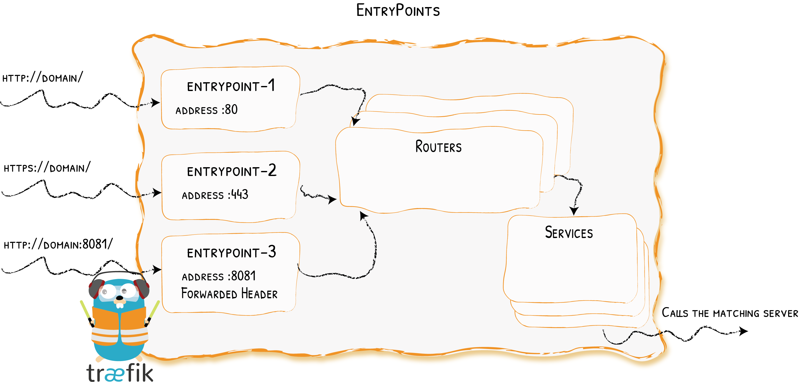

# 入口点

为传入请求打开连接
{: .subtitle }



EntryPoints是Traefik的网络入口点。
它们定义了将接收数据包的端口，以及监听TCP还是UDP。

## 配置示例

??? example "仅 80 端口"

    ```toml tab="文件 (TOML)"
    ## Static configuration
    [entryPoints]
      [entryPoints.web]
        address = ":80"
    ```
    
    ```yaml tab="文件 (YAML)"
    ## Static configuration
    entryPoints:
      web:
       address: ":80"
    ```
    
    ```bash tab="CLI"
    ## Static configuration
    --entryPoints.web.address=:80
    ```

    定义一个名为`web`的`entrypoint`，监听在`80`端口上。

??? example "端口 80 及 443" 

    ```toml tab="文件 (TOML)"
    ## Static configuration
    [entryPoints]
      [entryPoints.web]
        address = ":80"
    
      [entryPoints.websecure]
        address = ":443"
    ```
    
    ```yaml tab="文件 (YAML)"
    ## Static configuration
    entryPoints:
      web:
        address: ":80"
     
      websecure:
        address: ":443"
    ```
    
    ```bash tab="CLI"
    ## Static configuration
    --entryPoints.web.address=:80
    --entryPoints.websecure.address=:443
    ```

    - 定义了两个入口点：一个名为`web`，另一个名为`websecure`。
    - `web`监听在端口`80`上，`websecure`监听在端口`443`上.

??? example "UDP on port 1704"

    ```toml tab="文件 (TOML)"
    ## Static configuration
    [entryPoints]
      [entryPoints.streaming]
        address = ":1704/udp"
    ```

    ```yaml tab="文件 (YAML)"
    ## Static configuration
    entryPoints:
      streaming:
        address: ":1704/udp"
    ```

    ```bash tab="CLI"
    ## Static configuration
    --entryPoints.streaming.address=:1704/udp
    ```

## 配置

### General

入口点属于[静态配置(Static configuration)](../getting-started/configuration-overview.md#the-static-configuration)的一部分。
可以使用一个Toml文件，CLI参数，或是键值对存储来定义它们。

??? info "可用选项列表，请参看完整的参考"
    
    ```toml tab="文件 (TOML)"
    ## Static configuration
    [entryPoints]
      [entryPoints.name]
        address = ":8888" # same as ":8888/tcp"
        [entryPoints.name.transport]
          [entryPoints.name.transport.lifeCycle]
            requestAcceptGraceTimeout = 42
            graceTimeOut = 42
          [entryPoints.name.transport.respondingTimeouts]
            readTimeout = 42
            writeTimeout = 42
            idleTimeout = 42
        [entryPoints.name.proxyProtocol]
          insecure = true
          trustedIPs = ["127.0.0.1", "192.168.0.1"]
        [entryPoints.name.forwardedHeaders]
          insecure = true
          trustedIPs = ["127.0.0.1", "192.168.0.1"]
    ```
    
    ```yaml tab="文件 (YAML)"
    ## Static configuration
    entryPoints:
      name:
        address: ":8888" # same as ":8888/tcp"
        transport:
          lifeCycle:
            requestAcceptGraceTimeout: 42
            graceTimeOut: 42
          respondingTimeouts:
            readTimeout: 42
            writeTimeout: 42
            idleTimeout: 42
        proxyProtocol:
          insecure: true
          trustedIPs:
            - "127.0.0.1"
            - "192.168.0.1"
        forwardedHeaders:
          insecure: true
          trustedIPs:
            - "127.0.0.1"
            - "192.168.0.1"
    ```
    
    ```bash tab="CLI"
    ## Static configuration
    --entryPoints.name.address=:8888 # same as :8888/tcp
    --entryPoints.name.transport.lifeCycle.requestAcceptGraceTimeout=42
    --entryPoints.name.transport.lifeCycle.graceTimeOut=42
    --entryPoints.name.transport.respondingTimeouts.readTimeout=42
    --entryPoints.name.transport.respondingTimeouts.writeTimeout=42
    --entryPoints.name.transport.respondingTimeouts.idleTimeout=42
    --entryPoints.name.proxyProtocol.insecure=true
    --entryPoints.name.proxyProtocol.trustedIPs=127.0.0.1,192.168.0.1
    --entryPoints.name.forwardedHeaders.insecure=true
    --entryPoints.name.forwardedHeaders.trustedIPs=127.0.0.1,192.168.0.1
    ```

### 地址

地址定义了端口，以及可选的主机名，用以侦听传入连接和数据包。
它还定义了要使用的协议（TCP或UDP）。
如果未指定协议，则默认为TCP。
格式为：

```bash
[host]:port[/tcp|/udp]
```

如果同一端口同时需要TCP和UDP，则需要两个`entryPoints`定义，如下例。

??? example "Both TCP and UDP on port 3179"

    ```toml tab="文件 (TOML)"
    ## Static configuration
    [entryPoints]
      [entryPoints.tcpep]
        address = ":3179"
      [entryPoints.udpep]
        address = ":3179/udp"
    ```

    ```yaml tab="文件 (YAML)"
    ## Static configuration
    entryPoints:
      tcpep:
       address: ":3179"
      udpep:
       address: ":3179/udp"
    ```

    ```bash tab="CLI"
    ## Static configuration
    --entryPoints.tcpep.address=:3179
    --entryPoints.udpep.address=:3179/udp
    ```

### Forwarded Headers

您可以配置Traefik，以信任转发的HTTP头信息（`X-Forwarded-*`）。

??? info "`forwardedHeaders.trustedIPs`"
    
    信任来自指定IP的转发头(Forwarded Headers)。

    ```toml tab="文件 (TOML)"
    ## Static configuration
    [entryPoints]
      [entryPoints.web]
        address = ":80"
    
        [entryPoints.web.forwardedHeaders]
          trustedIPs = ["127.0.0.1/32", "192.168.1.7"]
    ```
    
    ```yaml tab="文件 (YAML)"
    ## Static configuration
    entryPoints:
      web:
        address: ":80"
        forwardedHeaders:
          trustedIPs:
            - "127.0.0.1/32"
            - "192.168.1.7"
    ```
    
    ```bash tab="CLI"
    ## Static configuration
    --entryPoints.web.address=:80
    --entryPoints.web.forwardedHeaders.trustedIPs=127.0.0.1/32,192.168.1.7
    ```

??? info "`forwardedHeaders.insecure`"
    
    非安全模式（始终信任转发头(Forwarded Headers)）。

    ```toml tab="文件 (TOML)"
    ## Static configuration
    [entryPoints]
      [entryPoints.web]
        address = ":80"
    
        [entryPoints.web.forwardedHeaders]
          insecure = true
    ```
    
    ```yaml tab="文件 (YAML)"
    ## Static configuration
    entryPoints:
      web:
        address: ":80"
        forwardedHeaders:
          insecure: true
    ```
    
    ```bash tab="CLI"
    ## Static configuration
    --entryPoints.web.address=:80
    --entryPoints.web.forwardedHeaders.insecure
    ```

### 传输(Transport)

#### `respondingTimeouts`

`respondingTimeouts` 是传入请求到Traefik实例间的超时时间。
设置它们对 UDP entryPoints 无效。

??? info "`transport.respondingTimeouts.readTimeout`"
    
    _可选，默认=0s_
    
    `readTimeout`是读取整个请求（包括请求体）的最大持续时间。

    如为0，则不设超时。
    可以用[time.ParseDuration](https://golang.org/pkg/time/#ParseDuration)支持的格式或原始值(数字)来提供。
    如果未提供单位，则以秒为单位解析该值。 

    ```toml tab="文件 (TOML)"
    ## Static configuration
    [entryPoints]
      [entryPoints.name]
        address = ":8888"
        [entryPoints.name.transport]
          [entryPoints.name.transport.respondingTimeouts]
            readTimeout = 42
    ```
    
    ```yaml tab="文件 (YAML)"
    ## Static configuration
    entryPoints:
      name:
        address: ":8888"
        transport:
          respondingTimeouts:
            readTimeout: 42
    ```
    
    ```bash tab="CLI"
    ## Static configuration
    --entryPoints.name.address=:8888
    --entryPoints.name.transport.respondingTimeouts.readTimeout=42
    ```

??? info "`transport.respondingTimeouts.writeTimeout`"
    
    _可选，默认=0s_

    `writeTimeout`是响应(Response)写入超时前的最大持续时间。

    它涵盖了从请求标头读取结束，到响应写入结束之间的时间。
    如为0，则不设超时。
    可以用[time.ParseDuration](https://golang.org/pkg/time/#ParseDuration)支持的格式或原始值(数字)提供。
    如果未提供单位，则以秒为单位解析该值。
    
    ```toml tab="文件 (TOML)"
    ## Static configuration
    [entryPoints]
      [entryPoints.name]
        address = ":8888"
        [entryPoints.name.transport]
          [entryPoints.name.transport.respondingTimeouts]
            writeTimeout = 42
    ```
    
    ```yaml tab="文件 (YAML)"
    ## Static configuration
    entryPoints:
      name:
        address: ":8888"
        transport:
          respondingTimeouts:
            writeTimeout: 42
    ```
    
    ```bash tab="CLI"
    ## Static configuration
    --entryPoints.name.address=:8888
    --entryPoints.name.transport.respondingTimeouts.writeTimeout=42
    ```

??? info "`transport.respondingTimeouts.idleTimeout`"
    
    _可选，默认=180s_
    
    `idleTimeout` is the maximum duration an idle (keep-alive) connection will remain idle before closing itself.  
    
    If zero, no timeout exists.  
    Can be provided in a format supported by [time.ParseDuration](https://golang.org/pkg/time/#ParseDuration) or as raw values (digits).
    If no units are provided, the value is parsed assuming seconds.
    
    ```toml tab="文件 (TOML)"
    ## Static configuration
    [entryPoints]
      [entryPoints.name]
        address = ":8888"
        [entryPoints.name.transport]
          [entryPoints.name.transport.respondingTimeouts]
            idleTimeout = 42
    ```
    
    ```yaml tab="文件 (YAML)"
    ## Static configuration
    entryPoints:
      name:
        address: ":8888"
        transport:
          respondingTimeouts:
            idleTimeout: 42
    ```
    
    ```bash tab="CLI"
    ## Static configuration
    --entryPoints.name.address=:8888
    --entryPoints.name.transport.respondingTimeouts.idleTimeout=42
    ```

#### `lifeCycle`

Controls the behavior of Traefik during the shutdown phase.

??? info "`lifeCycle.requestAcceptGraceTimeout`"
    
    _Optional, Default=0s_
    
    Duration to keep accepting requests prior to initiating the graceful termination period (as defined by the `graceTimeOut` option).
    This option is meant to give downstream load-balancers sufficient time to take Traefik out of rotation.
    
    Can be provided in a format supported by [time.ParseDuration](https://golang.org/pkg/time/#ParseDuration) or as raw values (digits).
    
    If no units are provided, the value is parsed assuming seconds.
    The zero duration disables the request accepting grace period, i.e., Traefik will immediately proceed to the grace period.
    
    ```toml tab="文件 (TOML)"
    ## Static configuration
    [entryPoints]
      [entryPoints.name]
        address = ":8888"
        [entryPoints.name.transport]
          [entryPoints.name.transport.lifeCycle]
            requestAcceptGraceTimeout = 42
    ```
    
    ```yaml tab="文件 (YAML)"
    ## Static configuration
    entryPoints:
      name:
        address: ":8888"
        transport:
          lifeCycle:
            requestAcceptGraceTimeout: 42
    ```
    
    ```bash tab="CLI"
    ## Static configuration
    --entryPoints.name.address=:8888
    --entryPoints.name.transport.lifeCycle.requestAcceptGraceTimeout=42
    ```

??? info "`lifeCycle.graceTimeOut`"
    
    _Optional, Default=10s_
    
    Duration to give active requests a chance to finish before Traefik stops.
    
    Can be provided in a format supported by [time.ParseDuration](https://golang.org/pkg/time/#ParseDuration) or as raw values (digits).
    
    If no units are provided, the value is parsed assuming seconds.
    
    !!! warning "In this time frame no new requests are accepted."
    
    ```toml tab="文件 (TOML)"
    ## Static configuration
    [entryPoints]
      [entryPoints.name]
        address = ":8888"
        [entryPoints.name.transport]
          [entryPoints.name.transport.lifeCycle]
            graceTimeOut = 42
    ```
    
    ```yaml tab="文件 (YAML)"
    ## Static configuration
    entryPoints:
      name:
        address: ":8888"
        transport:
          lifeCycle:
            graceTimeOut: 42
    ```
    
    ```bash tab="CLI"
    ## Static configuration
    --entryPoints.name.address=:8888
    --entryPoints.name.transport.lifeCycle.graceTimeOut=42
    ```

### ProxyProtocol

Traefik 支持 [ProxyProtocol](https://www.haproxy.org/download/2.0/doc/proxy-protocol.txt) 版本 1 和 2。
Traefik supports [ProxyProtocol](https://www.haproxy.org/download/2.0/doc/proxy-protocol.txt) version 1 and 2.

If Proxy Protocol header parsing is enabled for the entry point, this entry point can accept connections with or without Proxy Protocol headers.

If the Proxy Protocol header is passed, then the version is determined automatically.

??? info "`proxyProtocol.trustedIPs`" 
    
    Enabling Proxy Protocol with Trusted IPs.

    ```toml tab="文件 (TOML)"
    ## Static configuration
    [entryPoints]
      [entryPoints.web]
        address = ":80"
    
        [entryPoints.web.proxyProtocol]
          trustedIPs = ["127.0.0.1/32", "192.168.1.7"]
    ```
    
    ```yaml tab="文件 (YAML)"
    ## Static configuration
    entryPoints:
      web:
        address: ":80"
        proxyProtocol:
          trustedIPs:
            - "127.0.0.1/32"
            - "192.168.1.7"
    ```
    
    ```bash tab="CLI"
    --entryPoints.web.address=:80
    --entryPoints.web.proxyProtocol.trustedIPs=127.0.0.1/32,192.168.1.7
    ```

    IPs in `trustedIPs` only will lead to remote client address replacement: Declare load-balancer IPs or CIDR range here.

??? info "`proxyProtocol.insecure`"

    非安全模式（仅测试环境）。
    
    In a test environments, you can configure Traefik to trust every incoming connection.
    Doing so, every remote client address will be replaced (`trustedIPs` won't have any effect)

    ```toml tab="文件 (TOML)"
    ## Static configuration
    [entryPoints]
      [entryPoints.web]
        address = ":80"
    
        [entryPoints.web.proxyProtocol]
          insecure = true
    ```
    
    ```yaml tab="文件 (YAML)"
    ## Static configuration
    entryPoints:
      web:
        address: ":80"
        proxyProtocol:
          insecure: true
    ```
    
    ```bash tab="CLI"
    --entryPoints.web.address=:80
    --entryPoints.web.proxyProtocol.insecure
    ```

!!! warning "Queuing Traefik behind Another Load Balancer"

    When queuing Traefik behind another load-balancer, make sure to configure Proxy Protocol on both sides.
    Not doing so could introduce a security risk in your system (enabling request forgery).

## HTTP Options

This whole section is dedicated to options, keyed by entry point, that will apply only to HTTP routing.

### 重定向(Redirection)

??? example "HTTPS 重定向 (80 到 443)"
    
    ```toml tab="文件 (TOML)"
    [entryPoints.web]
      address = ":80"
      
      [entryPoints.web.http]
        [entryPoints.web.http.redirections]
          [entryPoints.web.http.redirections.entryPoint]
            to = "websecure"
            scheme = "https"
    
    [entryPoints.websecure]
      address = ":443"
    ```
    
    ```yaml tab="文件 (YAML)"
    entryPoints:
      web:
        address: :80
        http:
          redirections:
            entryPoint:
              to: websecure
              https: true
    
      websecure:
        address: :443
    ```
    
    ```bash tab="CLI"
    --entrypoints.web.address=:80
    --entrypoints.web.http.redirections.entryPoint.to=websecure
    --entrypoints.web.http.redirections.entryPoint.https=true
    --entrypoints.websecure.address=:443
    ```

#### `entryPoint`

This section is a convenience to enable (permanent) redirecting of all incoming requests on an entry point (e.g. port `80`) to another entry point (e.g. port `443`).
此部分为启用（永久）将入口点（例如端口“ 80”）上的所有传入请求重定向到另一个入口点（例如端口“ 443”）的便利。

??? info "`entryPoint.to`"
    
    _必需_
    
    目标入口点。

    ```toml tab="文件 (TOML)"
    [entryPoints.foo]
      # ...
      [entryPoints.foo.http.redirections]
        [entryPoints.foo.http.redirections.entryPoint]
          to = "bar"
    ```
    
    ```yaml tab="文件 (YAML)"
    entryPoints:
      foo:
        # ...
        http:
          redirections:
            entryPoint:
              to: bar
    ```
    
    ```bash tab="CLI"
    --entrypoints.foo.http.redirections.entryPoint.to=websecure
    ```

??? info "`entryPoint.scheme`"
    
    _Optional, Default="http"_
    
    重定向的目标Scheme

    ```toml tab="文件 (TOML)"
    [entryPoints.foo]
      # ...
      [entryPoints.foo.http.redirections]
        [entryPoints.foo.http.redirections.entryPoint]
          # ...
          scheme = "https"
    ```
    
    ```yaml tab="文件 (YAML)"
    entryPoints:
      foo:
        # ...
        http:
          redirections:
            entryPoint:
              # ...
              scheme: https
    ```
    
    ```bash tab="CLI"
    --entrypoints.foo.http.redirections.entryPoint.scheme=https
    ```

### 中间件(Middlewares)

中间件列表，该中间件列表默认放置在与已命名入口点关联的每个路由器的中间件列表之前。

```toml tab="文件 (TOML)"
[entryPoints.websecure]
  address = ":443"

  [entryPoints.websecure.http]
    middlewares = ["auth@file", "strip@file"]
```

```yaml tab="文件 (YAML)"
entryPoints:
  websecure:
    address: ':443'
    http:
      middlewares:
        - auth@file
        - strip@file
```

```bash tab="CLI"
entrypoints.websecure.address=:443
entrypoints.websecure.http.middlewares=auth@file,strip@file
```

### TLS

本节关于默认TLS配置，其应用到所有与已命名入口点关联的路由器。

如果一个TLS区块（即其任何字段）为用户定义，则默认配置根本不适用。

此TLS区块，等同于[HTTP路由器上的TLS区块](./routers/index.md#tls)。

```toml tab="文件 (TOML)"
[entryPoints.websecure]
  address = ":443"

    [entryPoints.websecure.http.tls]
      options = "foobar"
      certResolver = "leresolver"
      [[entryPoints.websecure.http.tls.domains]]
        main = "example.com"
        sans = ["foo.example.com", "bar.example.com"]
      [[entryPoints.websecure.http.tls.domains]]
        main = "test.com"
        sans = ["foo.test.com", "bar.test.com"]
```

```yaml tab="文件 (YAML)"
entryPoints:
  websecure:
    address: ':443'
    http:
      tls:
        options: foobar
        certResolver: leresolver
        domains:
          - main: example.com
            sans:
              - foo.example.com
              - bar.example.com
          - main: test.com
            sans:
              - foo.test.com
              - bar.test.com
```

```bash tab="CLI"
entrypoints.websecure.address=:443
entrypoints.websecure.http.tls.options=foobar
entrypoints.websecure.http.tls.certResolver=leresolver
entrypoints.websecure.http.tls.domains[0].main=example.com
entrypoints.websecure.http.tls.domains[0].sans=foo.example.com,bar.example.com
entrypoints.websecure.http.tls.domains[1].main=test.com
entrypoints.websecure.http.tls.domains[1].sans=foo.test.com,bar.test.com
```

??? example "Let's Encrypt"
    
    ```toml tab="文件 (TOML)"
    [entryPoints.websecure]
      address = ":443"
    
        [entryPoints.websecure.http.tls]
          certResolver = "leresolver"
    ```
    
    ```yaml tab="文件 (YAML)"
    entryPoints:
      websecure:
        address: ':443'
        http:
          tls:
            certResolver: leresolver
    ```
    
    ```bash tab="CLI"
    entrypoints.websecure.address=:443
    entrypoints.websecure.http.tls.certResolver=leresolver
    ```
