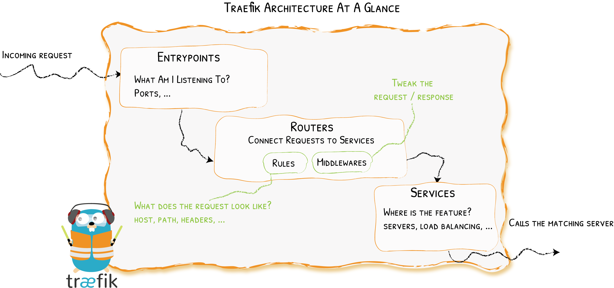

# 概览(Overview)

请求(Requests)发生了什么？
{: .subtitle }

让我们放大Traefik的体系结构，并讨论使路由得以创建的组件。

首先，当启动Traefik时，你定义了[入口点(Entrypoints)](../entrypoints) (以其最基本的形式，它们就是端口号)。
然后，连接到这些入口点的[路由器(Routers)](../routers)会分析传入的请求，以查看它们是否符合一组规则。
如果符合，路由器可能会在将请求转发到您的[服务(Services)](./services/index.md)之前，使用些许[中间件(middleware)](../middlewares/overview.md)来转换请求。



## 明确职责范围(Clear Responsibilities)

- [_提供者(Providers)_](../providers/overview.md) 发现您基础设施上存在的服务（它们的IP，健康状况，……）
- [_入口点(Entrypoints)_](./entrypoints.md) 侦听传入流量（端口，……）
- [_路由器(Routers)_](./routers/index.md) 分析请求（主机，请求路径，HTTP标头，SSL，……）
- [_服务(Services)_](./services/index.md) 将请求转发到您的服务（负载均衡器，……）
- [_中间件(Middlewares)_](../middlewares/overview.md) 可以更新请求，或根据请求做出决定（身份认证，速率限制，HTTP标头，……）

## 文件提供者示例(Example with a File Provider)

以下是[文件提供者(File provider)](../providers/file.md)的完整配置文件示例，该文件将`http://domain/whoami/`请求转发到在`http://private/whoami-service/`上可访问的服务。
在此过程中，Traefik将确保用户是通过身份验证的（使用[BasicAuth中间件](../middlewares/basicauth.md)）。

静态配置：

```toml tab="文件 (TOML)"
[entryPoints]
  [entryPoints.web]
    # 在端口8081上侦听传入请求
    address = ":8081"

[providers]
  # 启用文件提供者，使其能在文件中定义路由器/中间件/服务
  [providers.file]
    directory = "/path/to/dynamic/conf"
```

```yaml tab="文件 (YAML)"
entryPoints:
  web:
    # Listen on port 8081 for incoming requests
    address: :8081

providers:
  # Enable the file provider to define routers / middlewares / services in file
  file:
    directory: /path/to/dynamic/conf
```

```bash tab="CLI"
# Listen on port 8081 for incoming requests
--entryPoints.web.address=:8081

# Enable the file provider to define routers / middlewares / services in file
--providers.file.directory=/path/to/dynamic/conf
```

动态配置：

```toml tab="TOML"
# HTTP路由部分
[http]
  [http.routers]
     # 定义请求和服务之间的连接
     [http.routers.to-whoami]
      rule = "Host(`domain`) && PathPrefix(`/whoami/`)"
      # 如规则匹配，则应用中间件
      middlewares = ["test-user"]
      # 如规则匹配，则转发到whoami服务（声明在下方）
      service = "whoami"

  [http.middlewares]
    # 定义认证机制
    [http.middlewares.test-user.basicAuth]
      users = ["test:$apr1$H6uskkkW$IgXLP6ewTrSuBkTrqE8wj/"]

  [http.services]
    # 定义如何触达一个我们基础架构中现存的服务
    [http.services.whoami.loadBalancer]
      [[http.services.whoami.loadBalancer.servers]]
        url = "http://private/whoami-service"
```

```yaml tab="YAML"
# http routing section
http:
  routers:
    # Define a connection between requests and services
    to-whoami:
      rule: "Host(`domain`) && PathPrefix(`/whoami/`)"
       # If the rule matches, applies the middleware
      middlewares:
      - test-user
      # If the rule matches, forward to the whoami service (declared below)
      service: whoami

  middlewares:
    # Define an authentication mechanism
    test-user:
      basicAuth:
        users:
        - test:$apr1$H6uskkkW$IgXLP6ewTrSuBkTrqE8wj/

  services:
    # Define how to reach an existing service on our infrastructure
    whoami:
      loadBalancer:
        servers:
        - url: http://private/whoami-service
```

!!! info ""

    此例中，我们使用[文件提供者(File provider)](../providers/file.md)。
    即使这是配置Traefik的最神奇的方法之一，它也明确描述了每个可用的概念。

!!! info "HTTP / TCP"

    此例中，我们仅为HTTP请求定义了路由规则。
    Traefik还支持TCP请求。要添加[TCP路由器](./routers/index.md)和[TCP服务](./services/index.md)，请在TCP部分中声明它们，如下所示。

    ??? example "在whoami.traefik.io上，为TLS请求添加TCP路由"

        **静态配置(Static Configuration)**
        
        ```toml tab="File (TOML)"
        [entryPoints]
          [entryPoints.web]
            # Listen on port 8081 for incoming requests
            address = ":8081"

        [providers]
          # Enable the file provider to define routers / middlewares / services in file
          [providers.file]
            directory = "/path/to/dynamic/conf"
        ```
        
        ```yaml tab="File (YAML)"
        entryPoints:
          web:
            # Listen on port 8081 for incoming requests
            address: :8081
        providers:
          # Enable the file provider to define routers / middlewares / services in file
          file:
            directory: /path/to/dynamic/conf
        ```
        
        ```bash tab="CLI"
        # Listen on port 8081 for incoming requests
        --entryPoints.web.address=:8081
        
        # Enable the file provider to define routers / middlewares / services in file
        --providers.file.directory=/path/to/dynamic/conf
        ```
        
        **动态配置(Dynamic Configuration)**

        ```toml tab="TOML"
        # http routing section
        [http]
          [http.routers]
            # Define a connection between requests and services
            [http.routers.to-whoami]
              rule = "Host(`domain`) && PathPrefix(`/whoami/`)"
              # If the rule matches, applies the middleware
              middlewares = ["test-user"]
              # If the rule matches, forward to the whoami service (declared below)
              service = "whoami"

          [http.middlewares]
             # Define an authentication mechanism
             [http.middlewares.test-user.basicAuth]
               users = ["test:$apr1$H6uskkkW$IgXLP6ewTrSuBkTrqE8wj/"]

          [http.services]
             # Define how to reach an existing service on our infrastructure
             [http.services.whoami.loadBalancer]
               [[http.services.whoami.loadBalancer.servers]]
                 url = "http://private/whoami-service"

        [tcp]
          [tcp.routers]
            [tcp.routers.to-whoami-tcp]
              rule = "HostSNI(`whoami-tcp.traefik.io`)"
              service = "whoami-tcp"
              [tcp.routers.to-whoami-tcp.tls]

          [tcp.services]
            [tcp.services.whoami-tcp.loadBalancer]
              [[tcp.services.whoami-tcp.loadBalancer.servers]]
                address = "xx.xx.xx.xx:xx"
        ```
        
        ```yaml tab="YAML"
        # http routing section
        http:

          routers:
            # Define a connection between requests and services
            to-whoami:
              rule: Host(`domain`) && PathPrefix(`/whoami/`)
              # If the rule matches, applies the middleware
              middlewares:
              - test-user
              # If the rule matches, forward to the whoami service (declared below)
              service: whoami

          middlewares:
            # Define an authentication mechanism
            test-user:
              basicAuth:
                users:
                - test:$apr1$H6uskkkW$IgXLP6ewTrSuBkTrqE8wj/

          services:
            # Define how to reach an existing service on our infrastructure
            whoami:
              loadBalancer:
                servers:
                - url: http://private/whoami-service
        tcp:

          routers:
            to-whoami-tcp:
              service: whoami-tcp
              rule: HostSNI(`whoami-tcp.traefik.io`)

          services:
            whoami-tcp:
              loadBalancer:
                servers:
                - address: xx.xx.xx.xx:xx
        ```

## 传输配置(Transport configuration)

客户端和Traefik之间，以及随后的Traefik与后端服务器之间的连接，其所发生的大部分事情，都是通过[入口点](../entrypoints)和[路由器](../routers)进行配置的。

此外，一些参数专用于全局配置Traefik与后端之间的连接所发生的情况。
这是通过配置的`serversTransport`部分完成的，它具有以下选项：

### `insecureSkipVerify`

_可选，默认=false_

`insecureSkipVerify` 禁用了SSL证书验证。

```toml tab="文件 (TOML)"
## Static configuration
[serversTransport]
  insecureSkipVerify = true
```

```yaml tab="文件 (YAML)"
## Static configuration
serversTransport:
  insecureSkipVerify: true
```

```bash tab="CLI"
## Static configuration
--serversTransport.insecureSkipVerify=true
```

### `rootCAs`

_可选_

`rootCAs` 是证书的列表（文件路径或数据字节），使用自签名TLS证书时将被设置为“根证书颁发机构”。

```toml tab="File (TOML)"
## Static configuration
[serversTransport]
  rootCAs = ["foo.crt", "bar.crt"]
```

```yaml tab="File (YAML)"
## Static configuration
serversTransport:
  rootCAs:
    - foo.crt
    - bar.crt
```

```bash tab="CLI"
## Static configuration
--serversTransport.rootCAs=foo.crt,bar.crt
```

### `maxIdleConnsPerHost`

_可选，默认=2_

如不为0，`maxIdleConnsPerHost` 控制每个主机要保留的最大空闲（保持活动(keep-alive)）连接数。

```toml tab="File (TOML)"
## Static configuration
[serversTransport]
  maxIdleConnsPerHost = 7
```

```yaml tab="File (YAML)"
## Static configuration
serversTransport:
  maxIdleConnsPerHost: 7
```

```bash tab="CLI"
## Static configuration
--serversTransport.maxIdleConnsPerHost=7
```

### `forwardingTimeouts`

`forwardingTimeouts` 与请求转发到后端服务器相关的超时数值。

#### `forwardingTimeouts.dialTimeout`

_可选，默认=30s_

`dialTimeout` 是建立与后端服务器的连接所允许的最大持续时间。0表示不设超时。

```toml tab="File (TOML)"
## Static configuration
[serversTransport.forwardingTimeouts]
  dialTimeout = "1s"
```

```yaml tab="File (YAML)"
## Static configuration
serversTransport:
  forwardingTimeouts:
    dialTimeout: 1s
```

```bash tab="CLI"
## Static configuration
--serversTransport.forwardingTimeouts.dialTimeout=1s
```

#### `forwardingTimeouts.responseHeaderTimeout`

_可选, 默认=0s_

`responseHeaderTimeout`，如果不为零，则指定在完全写入请求（包括请求体，如果有）之后，等待服务器的响应头的时间。
该时间不包括读取响应包体(Response Body)的时间。0表示不设超时。

```toml tab="File (TOML)"
## Static configuration
[serversTransport.forwardingTimeouts]
  responseHeaderTimeout = "1s"
```

```yaml tab="File (YAML)"
## Static configuration
serversTransport:
  forwardingTimeouts:
    responseHeaderTimeout: 1s
```

```bash tab="CLI"
## Static configuration
--serversTransport.forwardingTimeouts.responseHeaderTimeout=1s
```

#### `forwardingTimeouts.idleConnTimeout`

_可选，默认=90s_

`idleConnTimeout`，是空闲（保持活动状态）连接在关闭自身之前，其保持空闲状态的最长时间。0表示不设超时。

```toml tab="File (TOML)"
## Static configuration
[serversTransport.forwardingTimeouts]
  idleConnTimeout = "1s"
```

```yaml tab="File (YAML)"
## Static configuration
serversTransport:
  forwardingTimeouts:
    idleConnTimeout: 1s
```

```bash tab="CLI"
## Static configuration
--serversTransport.forwardingTimeouts.idleConnTimeout=1s
```
